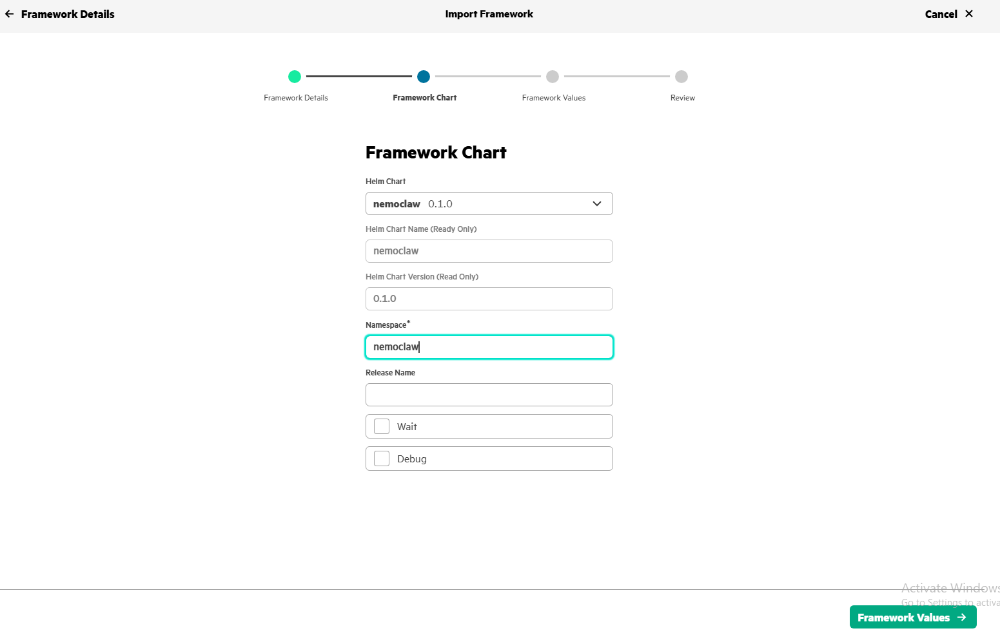

# NemoClaw Deployment on HPE Private Cloud AI


## 📑 Table of Contents

- [Description](#description)
- [Key Features](#key-features)
- [Use Cases](#use-cases)
- [Quick Start](#quick-start)
- [Project Structure](#project-structure)
- [Contributing](#contributing)

## 📝 Description

NVIDIA NemoClaw deploys very well in Docker-based environments. However, deploying NemoClaw on Kubernetes is more complex, as NVIDIA currently does not provide a complete end-to-end deployment guide or reference architecture for Kubernetes platforms such as HPE Private Cloud AI.

This project provides a comprehensive step-by-step guide for deploying NemoClaw on Kubernetes running within HPE Private Cloud AI. It first explains the deployment architecture and core concepts, then walks through the installation, configuration, and deployment procedures required to successfully run NemoClaw in an enterprise Kubernetes environment. In the event if you don't have HPE Private Cloud AI, this solution also work on kubernetes on any platform. 

## ✨ Key Features

- **📂 HPE Private Cloud AI** — A turnkey private cloud platform, co-engineered with Nvidia to delivers a complete, secure AI workbench for rapid deployment of AI models and production use cases. 
- **🛠️ Ready to be deploy** — You can clone and deploy on any kubernetes with minor modification. 

## 🎯 Use Cases

- Establishing a clean slate for starting a new software prototype.
- Testing repository connection, configuration, and integration pipelines with minimal noise.

## ⚡ Quick Start

# 1. Clone the repository
git clone https://github.com/gsoonh/nemoclawOnPCAI.git

# 2. Make sure you have a model to serve the openclaw. i am using Mistra: 7b hosted on ollama.

# 3. Launch HPE Private Cloud AI and login. Select Tools & Framework, choose import Framework.
     a. Fill up as shown in "pcai-import1.PNG" in the image folder.
     b. Click Framework Chart on the bottom right, [populate as show in "pcai-import2.PNG". The required upload file is the
        nemoclaw-0.1.0.tgz.

        ```



#4.  In the value section, you should something similar.  


# Architecture
```

## 📁 Project Structure

```
.
```

## 👥 Contributing

Contributions are welcome! Here's the standard flow:

1. **Fork** the repository
2. **Clone** your fork: `git clone https://github.com/your-username/repo.git`
3. **Branch**: `git checkout -b feature/your-feature`
4. **Commit**: `git commit -m 'feat: add some feature'`
5. **Push**: `git push origin feature/your-feature`
6. **Open** a pull request

Please follow the existing code style and include tests for new behavior where applicable.


