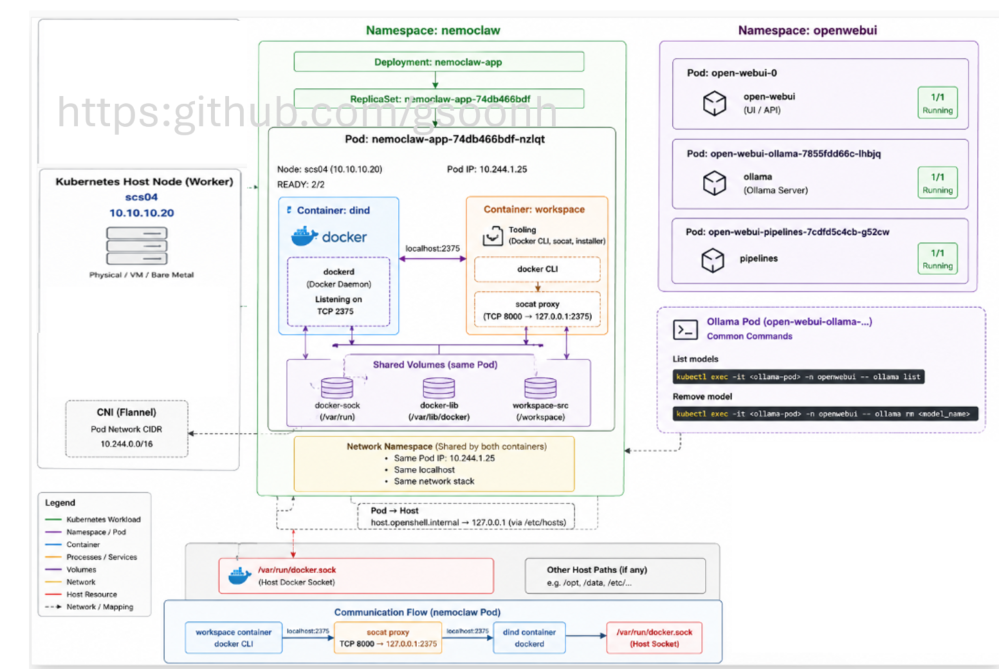
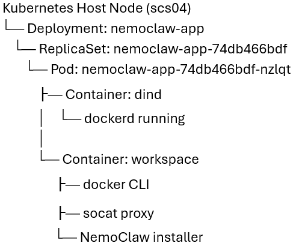

# NemoClaw Deployment on HPE Private Cloud AI


## 📑 Table of Contents

- [Description](#description)
- [Key Features](#key-features)
- [Use Cases](#use-cases)
- [Quick Start](#quick-start)
- [Project Structure](#project-structure)
- [Contributing](#contributing)

## 📝 Description

NVIDIA NemoClaw deploys very well in Docker-based environments. However, deploying NemoClaw on Kubernetes is more complex, as NVIDIA currently does not provide a complete end-to-end deployment guide or reference architecture for Kubernetes platforms such as HPE Private Cloud AI (PCAI).

This project provides a comprehensive step-by-step guide for deploying NemoClaw on Kubernetes running within HPE PCAI. It first explains the deployment architecture and core concepts, then walks through the installation, configuration, and deployment procedures required to successfully run NemoClaw in an enterprise Kubernetes environment. In the event if you don't have HPE PCAI, this solution also work on kubernetes on any platform with minor changes.

## ✨ Key Features

- **📂 HPE Private Cloud AI** — A turnkey private cloud platform, co-engineered with Nvidia to delivers a complete, secure AI workbench for rapid deployment of AI models and production use cases. 
- **🛠️ Ready to be deploy** — You can clone and deploy on any kubernetes with minor modification. 

## 🎯 Use Cases

- 24 hours Personal Autonomous Assistant - Always-on Personal Assistant, calender/email/research automation, task planning and reminders.
- Autonomous IT Operation - Kubernetes troubeshooting, infrastructure deployment, CICD automation, monitor and alert remediation, etc
- multi-agent enterprise automation - emerging use cases that deploy a fleet of ai agents to do finance, HR, procurement and customer operations

## ⚡ Quick Start

# 1. Clone the repository
```
git clone https://github.com/gsoonh/nemoclawOnPCAI.git
```
# 2. Make sure you have a model to serve the openclaw. 
For my case, I deploy mistra:7b on ollama and expose it out as an end-point.  In HPE PCAI, you can also deploy a model using MLIS and expose it out as a API endpoint. I choose ollama for simplicity.

# 3. Deploy on HPE PCAI using Import Framework 
I had included the deployment steps as images: pcai-import1.PNG to pcai-import4.PNG. Refer it in the "images" folder. 
To do so, login to HPE PCAI, go to Tools/Framework and choose import framework and follow the deployment steps. Take note the deployment process will take some time to complete. Give it at least 10 minutes. You can check the status using this:
```
kubectl logs $(kubectl get pod -n nemoclaw -l app=nemoclaw -o jsonpath='{.items[0].metadata.name}')   -n nemoclaw -c workspace --tail=50
```
If you are NOT using HPE PCAI, you can deploy directly using the helm chart. However, you would need to modify the values.yaml file. In particular, the "ezua" section and replace with your own virtualservices. Also, reconfigure your istiogateway. Also, in the virtualServices.yaml file, remove all the "hpe-ezua" label or any "ezua" related settings. After all these are done, you would need to repackage your helm chart.

# 4. The Outcome
If you had successfully deployed. You should see this nemoclaw-icon (in "images" folder) in "Import Framework" section. It should show "Ready" and you can click "Open" to open the user interface. Whe you are at the user interface, you would need the gateway token to access. You can run the following command.

```
kubectl get pods -n nemoclaw 
```
NAME                            READY   STATUS    RESTARTS   AGE
<your pod name>                  2/2     Running   0          88m

We need to console into the workspace container to get the gateway-token. Replace <your pod name> with the actual name.
```
kubectl exec -it  -n <your pod name> -c workspace -- sh
```
Once you are inside the workspace container. You need to run the following command to get the gateway-token.
```
#nemoclaw list
  Sandboxes:
    gsh-assistant *
      agent: openclaw  model: mistral:7b  provider: compatible-endpoint  CPU sandbox  policies: none
      dashboard: http://127.0.0.1:18789/
  * = default sandbox

# nemoclaw gsh-assistant gateway-token --quiet
dur1rR-Q0LaPMg-qgH1lF87sREMAF5wI7-rVt1qgf60
```
Put the string into the UI and you should be able to access it. Take note the gateway token will expire so you may need to generate the token quite frequently.

You should be able to start interacting with the user interface. See "result" in "images" folder.


# Architecture

Here is the architecture diagram:



NemoClaw is deployed on a Kubernetes (k8s) cluster running on one worker nodes. Since k8s uses containerd instead of Docker as its native runtime, the cluster does not provide a Docker daemon (dockerd) required by the NemoClaw onboarding workflow. To bridge this gap, the nemoclaw-app Pod runs a dedicated Docker-in-Docker (DinD) container that provides an isolated Docker daemon inside k3s. Alongside it, a separate workspace container hosts the Docker CLI, NemoClaw tooling, installer logic, and socat proxy services. Both containers operate side-by-side within the same Pod, sharing the same localhost network namespace, Pod IP, and mounted volumes such as /var/run. This allows the workspace container to communicate directly with the Docker daemon exposed by the DinD container through localhost:2375 and shared Docker socket paths, enabling NemoClaw onboarding and container lifecycle operations to function seamlessly inside a containerd-based , k3s environment. The deployment follows Kubernetes’ native ownership hierarchy — Deployment → ReplicaSet → Pod — providing scalability, resiliency, and orchestration benefits while maintaining a fully self-contained Docker-enabled workspace. In parallel, the openwebui namespace hosts mistra:7b model that will be use by openclaw.


## 📁 Deployment Structure
This is the deployment structure:


## 👥 Contributing

Contributions are welcome! Here's the standard flow:

1. **Fork** the repository
2. **Clone** your fork: `git clone https://github.com/your-username/repo.git`
3. **Branch**: `git checkout -b feature/your-feature`
4. **Commit**: `git commit -m 'feat: add some feature'`
5. **Push**: `git push origin feature/your-feature`
6. **Open** a pull request

Please follow the existing code style and include tests for new behavior where applicable.


